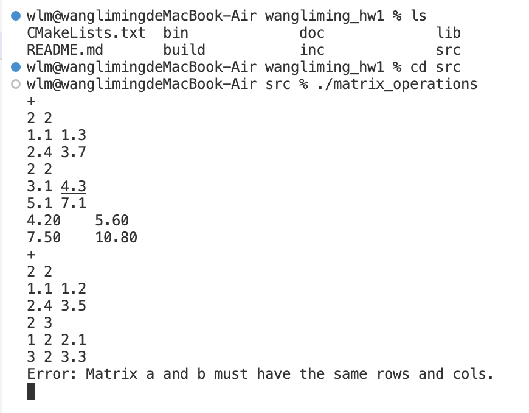
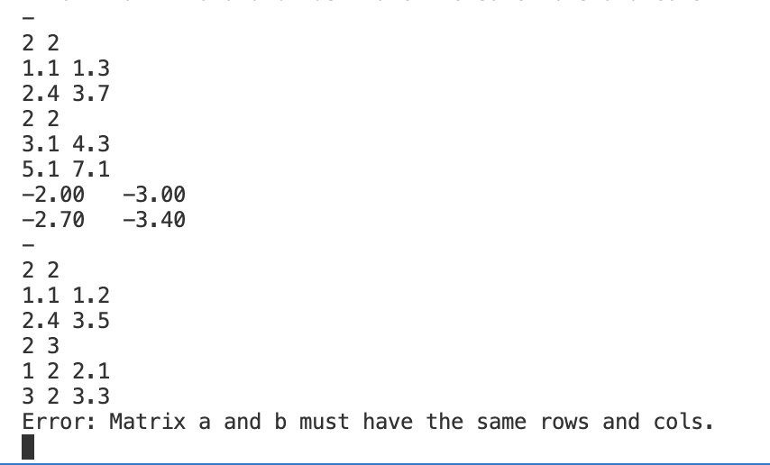
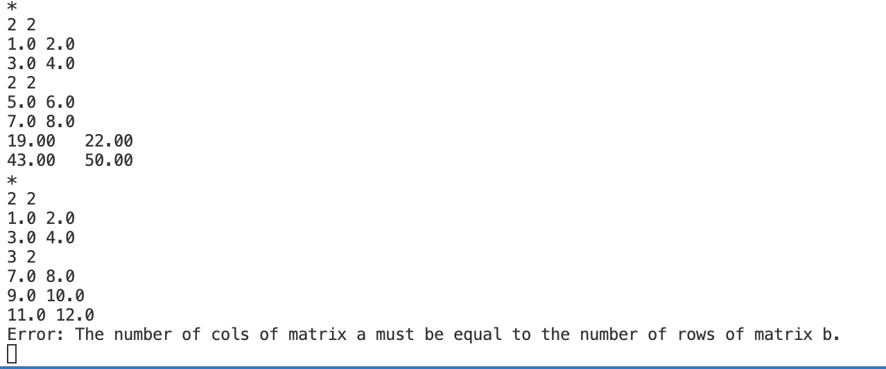
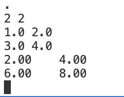
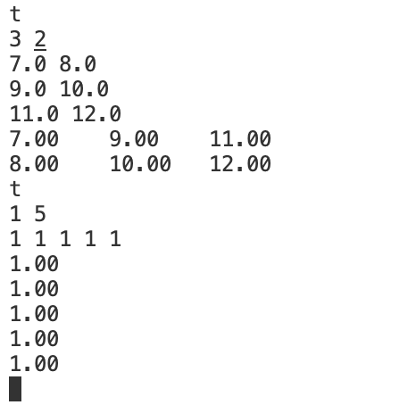
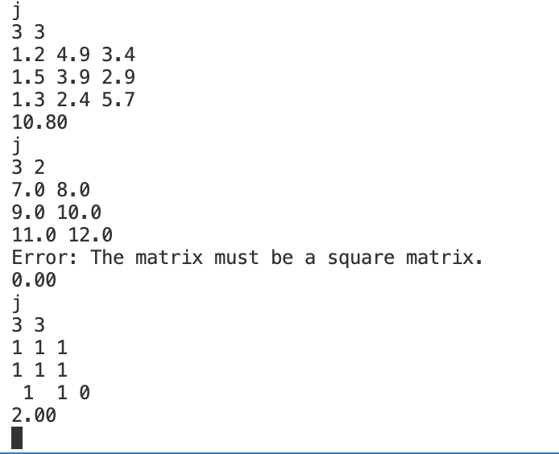
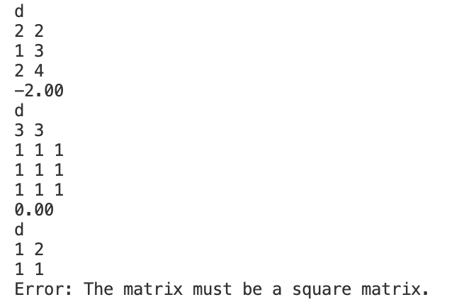
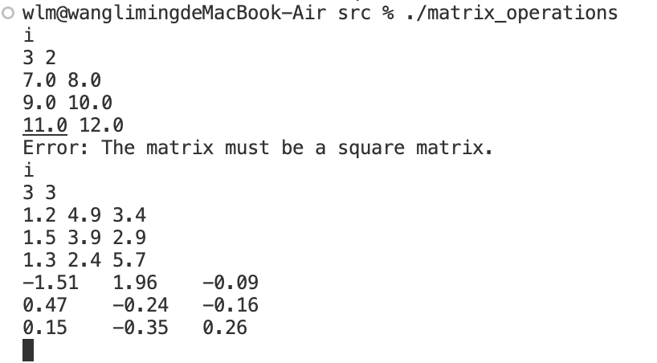

# 思路展示
- **第一步**：将仓库fork到自己的账号下，然后再clone到本地。
- **第二步**：直接开始补全文件夹lib。
- **第三步**：完成CMakelists，通过makefile生成build和bin文件夹。
- **第四步**：文件夹补全后开始补全代码。
- **矩阵加法**：
- **矩阵减法**：
- **矩阵乘法**：
- **矩阵数乘**：

- **矩阵转置**：
- **矩阵求迹**：
- **求行列式**：直接按照第一行展开，然后用递归的思想计算行列式。

- **求逆矩阵**：先用行列式判断是否为0，以及判断是否是方阵，然后用公式计算，本质是找到伴随矩阵。

- **矩阵求秩**：用高斯消元法，判断对角线是否为0，是0则向下搜索找到是否有非零元素，找到则交换两行，开始进行高斯消元；找不到则本行无需高斯消元。最后检查一下几行为全0，就rank减几。（浮点数判断为0用<极小数来判断）
